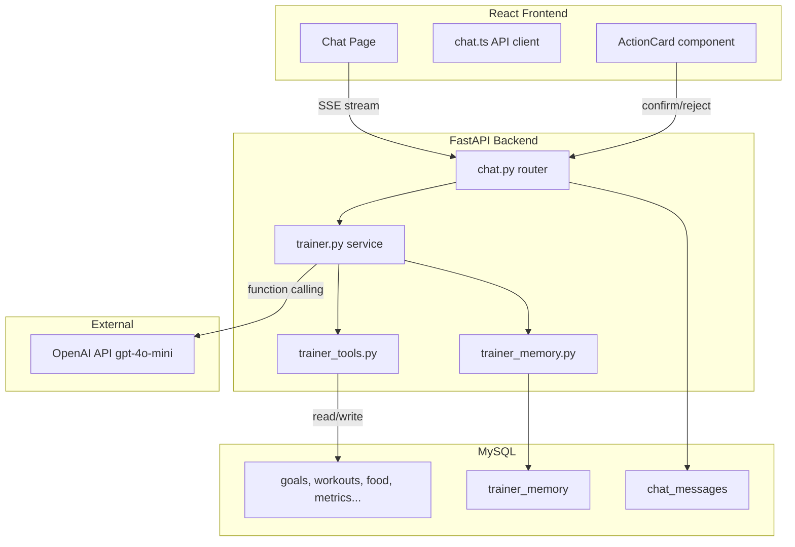
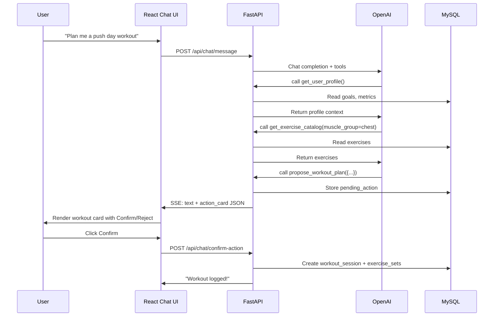

# AI Trainer Chatbot

## Architecture Overview




## Confirm-Then-Act Flow




## New Database Tables

Two new tables added in `[backend/db.py](backend/db.py)` `setup_database()`:

`**chat_messages**` -- conversation history (capped per user)

```sql
CREATE TABLE IF NOT EXISTS chat_messages (
    id INT AUTO_INCREMENT PRIMARY KEY,
    user VARCHAR(255) NOT NULL,
    role ENUM('user','assistant','system','tool') NOT NULL,
    content TEXT,
    tool_calls JSON,
    action_data JSON,
    created_at TIMESTAMP DEFAULT CURRENT_TIMESTAMP,
    INDEX idx_user_created (user, created_at)
);
```

`**trainer_memory**` -- persistent cross-session context (limited ~30 per user)

```sql
CREATE TABLE IF NOT EXISTS trainer_memory (
    id INT AUTO_INCREMENT PRIMARY KEY,
    user VARCHAR(255) NOT NULL,
    category ENUM('injury','preference','limitation','medical','schedule','experience','other') NOT NULL,
    content VARCHAR(500) NOT NULL,
    created_at TIMESTAMP DEFAULT CURRENT_TIMESTAMP,
    INDEX idx_user (user)
);
```

`**pending_actions**` -- proposed actions awaiting user confirmation

```sql
CREATE TABLE IF NOT EXISTS pending_actions (
    id INT AUTO_INCREMENT PRIMARY KEY,
    user VARCHAR(255) NOT NULL,
    action_type ENUM('update_goals','create_workout','log_food','log_water') NOT NULL,
    payload JSON NOT NULL,
    status ENUM('pending','confirmed','rejected','expired') DEFAULT 'pending',
    created_at TIMESTAMP DEFAULT CURRENT_TIMESTAMP,
    INDEX idx_user_status (user, status)
);
```

## Backend -- New Files

### 1. `backend/routers/chat.py`

FastAPI router mounted at `/api/chat` in `[backend/main.py](backend/main.py)`.

- `**POST /message**` -- Accept user message, stream AI response via SSE (`StreamingResponse`). Event types:
  - `text` -- streamed text tokens
  - `status` -- tool execution status (e.g., "Looking at your workouts...")
  - `action` -- proposed action card (JSON with `action_id`, `action_type`, `display_data`)
  - `done` -- stream complete
- `**GET /history**` -- Return last N messages for the user (default 50)
- `**POST /confirm-action**` -- Execute a pending action by `action_id`
- `**POST /reject-action**` -- Mark action as rejected
- `**GET /memories**` -- Return user's stored memories
- `**DELETE /memories/{id}**` -- Delete a specific memory
- `**DELETE /history**` -- Clear chat history for user

### 2. `backend/services/trainer.py`

Core orchestration service:

- Build system prompt incorporating: trainer persona, user memories, current date
- Manage OpenAI chat completion with `stream=True` and `tools` parameter
- Handle the tool-call loop: when OpenAI returns a tool call, execute it, feed result back, continue streaming
- Serialize assistant messages + tool results to `chat_messages` table
- Load recent conversation history (last ~20 messages) for context window
- Cap total context by summarizing older messages if needed

System prompt persona (excerpt):

> You are an expert fitness trainer and nutrition coach. You have access to the user's workout history, nutrition data, body metrics, and goals. You remember important context about the user across sessions. When suggesting changes to goals, workout plans, or food logging, always propose them as structured actions for the user to confirm -- never silently modify data. Be encouraging, evidence-based, and concise.

### 3. `backend/services/trainer_tools.py`

OpenAI function-calling tool definitions and executor functions:


| Tool                    | Purpose                                         | Reads/Writes                                           |
| ----------------------- | ----------------------------------------------- | ------------------------------------------------------ |
| `get_user_profile`      | Goals, body metrics, training days              | Read: `user_goals`, `body_metrics`                     |
| `get_workout_history`   | Recent sessions + sets with exercise names      | Read: `workout_sessions`, `exercise_sets`, `exercises` |
| `get_nutrition_summary` | Daily macros for last N days                    | Read: `food_intake`, `food_items`, `water_intake`      |
| `get_exercise_catalog`  | Available exercises, filterable by muscle group | Read: `exercises`                                      |
| `get_body_metrics`      | Weight/measurement trend                        | Read: `body_metrics`                                   |
| `propose_goal_update`   | Propose new goal targets                        | Write: `pending_actions`                               |
| `propose_workout_plan`  | Propose a full workout session                  | Write: `pending_actions`                               |
| `propose_food_log`      | Propose logging food/water intake               | Write: `pending_actions`                               |
| `save_memory`           | Store important user context                    | Write: `trainer_memory`                                |


### 4. `backend/services/trainer_memory.py`

Memory management:

- `load_memories(user)` -- fetch all memories for system prompt injection
- `save_memory(user, category, content)` -- save new memory, enforce 30-item cap (delete oldest if over limit)
- `delete_memory(user, memory_id)` -- remove specific memory
- `get_memories(user)` -- list all memories for the UI

## Frontend -- New Files

### 5. `frontend/src/pages/Chat.tsx`

Full-page chat interface inside the existing `Layout`:

- Message list with auto-scroll
- Input bar with send button (Enter to send)
- Streaming text rendering with a typing indicator
- `ActionCard` component for proposed actions (rendered inline in messages)
- Confirm/Reject buttons on action cards
- "Thinking..." / tool-use status indicators
- Load history on mount via `GET /api/chat/history`

### 6. `frontend/src/api/chat.ts`

API client functions:

- `streamMessage(content: string, onEvent: callback)` -- POST to `/chat/message`, parse SSE stream
- `getChatHistory()` -- GET `/chat/history`
- `confirmAction(actionId: number)` -- POST `/chat/confirm-action`
- `rejectAction(actionId: number)` -- POST `/chat/reject-action`
- `getMemories()` -- GET `/chat/memories`
- `deleteMemory(id: number)` -- DELETE `/chat/memories/{id}`
- `clearHistory()` -- DELETE `/chat/history`

### 7. `frontend/src/components/chat/` (directory)

- `**MessageBubble.tsx**` -- Renders user/assistant messages with markdown support
- `**ActionCard.tsx**` -- Renders proposed actions (workout plan table, goal changes, food log) with Confirm/Reject buttons
- `**TypingIndicator.tsx**` -- Animated dots while AI is responding
- `**StatusBadge.tsx**` -- Shows tool-use status ("Reading your workout history...")

## Modifications to Existing Files

### 8. `[backend/main.py](backend/main.py)` -- Register chat router

```python
from backend.routers import auth, exercises, workouts, food, goals, metrics, body, chat
# ...
app.include_router(chat.router, prefix="/api/chat", tags=["chat"])
```

### 9. `[backend/db.py](backend/db.py)` -- Add new tables in `setup_database()`

Add CREATE TABLE statements for `chat_messages`, `trainer_memory`, and `pending_actions` (schemas above).

### 10. `[frontend/src/App.tsx](frontend/src/App.tsx)` -- Add chat route

```tsx
const Chat = lazy(() => import('./pages/Chat'));
// inside Routes:
<Route path="chat" element={<Chat />} />
```

### 11. `[frontend/src/components/Sidebar.tsx](frontend/src/components/Sidebar.tsx)` -- Add chat nav item

Add a `MessageCircle` icon link to `/chat` labeled "AI Trainer" in the `navItems` array.

### 12. `[frontend/nginx.conf](frontend/nginx.conf)` -- Enable SSE for chat endpoint

Add a location block that disables proxy buffering for the streaming chat endpoint:

```nginx
location /api/chat/ {
    proxy_pass http://api:8000;
    proxy_set_header Host $host;
    proxy_set_header X-Real-IP $remote_addr;
    proxy_buffering off;
    proxy_cache off;
    proxy_read_timeout 300s;
}
```

### 13. `[.env.template](.env.template)` -- Document OPENAI_API_KEY requirement

`OPENAI_API_KEY` is already listed. No change needed unless we want to add a `TRAINER_MODEL` override (default `gpt-4o-mini`).

### 14. `[docker-compose.yml](docker-compose.yml)` -- Pass OPENAI_API_KEY to api service

Ensure the `api` service has access to `OPENAI_API_KEY` from `.env` (already covered by `env_file: .env`).

### 15. `requirements.txt` -- Ensure `openai` is present

`openai` is already in `requirements.txt`. No new dependencies needed -- we use the OpenAI Python SDK directly (no LangChain overhead for the chatbot).

## Memory System Design

Memories are injected into the system prompt like:

```
## What you remember about this user:
- [injury] Left shoulder pain -- avoid overhead pressing (saved 2026-03-20)
- [preference] Prefers morning workouts before 8am (saved 2026-03-18)
- [experience] 3 years of consistent weight training (saved 2026-03-15)
- [medical] Vegetarian diet, no supplements (saved 2026-03-15)
- [schedule] Can train Mon/Wed/Fri/Sat (saved 2026-03-14)
```

The AI is instructed to call `save_memory` when the user shares important persistent context. The 30-item cap per user keeps the system prompt bounded. Users can view and delete memories from the chat UI (small "Memories" panel or accessible via a button).