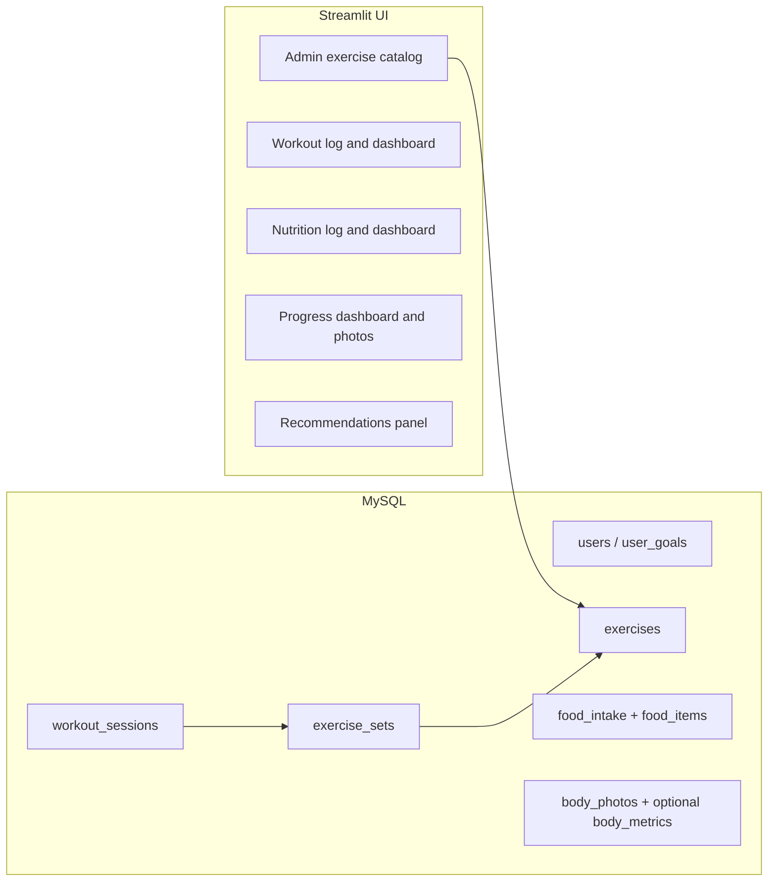

# Fitness tracker V1 (workouts, food, photos, metrics, recommendations)

## Current baseline

- App entry: [healthTrackerAppStreamlit.py](healthTrackerAppStreamlit.py) — `setup_database()` creates `users`, `food_intake`, `food_items`, `water_intake`; sidebar tabs for food, water, raw tables, “Metrices” (nutrition only), PDF health report.
- Nutrition math already exists in `calculate_metrices()` via join `food_intake` → `food_items` (protein, fat, calories). `**food_items` has no `carbs` column today** — add it for your macro model and backfill from Excel if the column exists there.
- Auth already exposes `**role`** (`admin` / `user`) in session — reuse for gating the catalog admin UI.
- **No exercise tables, no photo storage, no calorie/protein targets, no user goal type** — all net-new.

## Target architecture (V1)

Keep Docker MySQL as in [docker-compose.yml](docker-compose.yml). Kafka can stay for unrelated experiments; **fitness V1 does not need it**.

---

## 1. Data model (MySQL)

**User goals and targets** (new table or columns — prefer `user_goals` keyed by `user` string to match existing `food_intake.user` pattern):

- `goal_type`: `muscle_gain` | `fat_loss` | `recomposition`
- `calorie_target`, `protein_target` (g/day), optional `carb_target`, `fat_target`
- Optional `training_days_per_week` target for adherence

**Exercise catalog (backend, N exercises)** — canonical list the app loads for pickers and metrics:

| Table       | Role                                                                                                                                               |
| ----------- | -------------------------------------------------------------------------------------------------------------------------------------------------- |
| `exercises` | `id`, `name` (unique), `muscle_group` (e.g. chest, back, legs, shoulders, arms, core, full_body), optional `equipment` / `is_active` for filtering |

- **Seeding (bootstrap only):** ship a **CSV or SQL seed** in the repo. On app/db init, **insert rows that do not already exist by `name`** (e.g. `INSERT IGNORE` or `INSERT ... SELECT ... WHERE NOT EXISTS`). **Do not run a full upsert that overwrites `muscle_group` / `equipment` on every startup** — that would wipe admin edits. Optional: admin-only **“Import CSV”** button with explicit rules (skip duplicates vs overwrite empty fields).
- **Admin catalog editor (V1, required):** sidebar tab or page **visible only when** `st.session_state.role == 'admin'` (already set in [healthTrackerAppStreamlit.py](healthTrackerAppStreamlit.py) after login).
  - **List / search** all exercises (paginate or filter if N is large).
  - **Create:** name (unique), muscle_group, optional equipment; default `is_active = 1`.
  - **Edit:** same fields; renames keep the same `id` so historical `exercise_sets` stay attached.
  - **Deactivate:** set `is_active = 0` — exercise **hidden from user pickers** but still joinable for history and metrics. Prefer this over **hard delete**; if hard delete is offered, **forbid** when `exercise_sets` reference the row (FK `ON DELETE RESTRICT` or app check).

**Exercise log** (normalized: one workout session, many sets; each set points at catalog exercise):

| Table              | Role                                                                                                              |
| ------------------ | ----------------------------------------------------------------------------------------------------------------- |
| `workout_sessions` | `id`, `user`, `session_date`, optional `notes`                                                                    |
| `exercise_sets`    | `session_id`, `exercise_id` (FK → `exercises`), `set_order`, `reps`, `weight`, `rpe` (nullable), `rir` (nullable) |

- **Muscle group for dashboards** comes from `JOIN exercises` (single source of truth). No free-text exercise name on the set row in V1 — avoids typos and keeps “sets by muscle group” consistent.
- RPE *or* RIR remains optional; hard-set logic unchanged.

**Interactive logging UX (Streamlit)**

- **Choose exercise:** searchable/filterable picker — e.g. `st.selectbox` on a list filtered by text input and optional **muscle_group** filter, or a small dependency like `streamlit-option-menu` / selectbox grouped by muscle if dependency budget allows. Goal: comfortable with **large N**. Query: `**WHERE is_active = 1`** (admins still see inactive in admin UI only).
- **Add sets:** for the selected exercise, user enters **weight + reps** per set; “Add another set” / dynamic rows (session state or `st.data_editor` for a compact grid).
- **Multiple exercises per session:** after saving sets for one exercise, user picks the next exercise (same session until they “Finish workout”).

**Food log** — align with your model without breaking existing rows:

- Add `**carbs`** to `food_items` (per serving, same scale as protein/fat/calories).
- Optionally add nullable `**calories`, `protein`, `carbs`, `fat`** on `food_intake` for custom items not in the catalog; when null, compute from `food_items` as today.

**Body pictures + progress measures**

- `body_photos`: `user`, `taken_date`, `file_path` (store files under e.g. `./uploads/{username}/` with Streamlit `st.file_uploader`), optional `notes`.
- `body_metrics` (for recomposition): `user`, `date`, `weight_kg`, `waist_cm` (nullable) — simple form + charts.

**Migration strategy:** use `CREATE TABLE IF NOT EXISTS` + `ALTER TABLE ... ADD COLUMN` guarded by checks (or one-off migration SQL) so existing Docker volumes keep working.

---

## 2. The eight V1 metrics — definitions and data sources

| Metric                                | Definition (V1)                                                                                                                               | Source                                              |
| ------------------------------------- | --------------------------------------------------------------------------------------------------------------------------------------------- | --------------------------------------------------- |
| **Workout count per week**            | Count distinct `session_date` (or sessions) in ISO week                                                                                       | `workout_sessions`                                  |
| **Volume load per workout**           | Sum of `reps * weight` over sets in that session                                                                                              | `exercise_sets`                                     |
| **Weekly hard sets per muscle group** | Count sets where `(RPE >= 7)` OR `(RIR <= 3)` when provided; ignore set if both null                                                          | `exercise_sets` **JOIN** `exercises` (muscle_group) |
| **Estimated 1RM trend**               | Per **catalog** exercise: e.g. **Epley** on each set, take session max per `exercise_id`, trend over weeks                                    | `exercise_sets` + `exercises.name` for display      |
| **Calories / protein per day**        | Sum logged macros for day                                                                                                                     | `food_intake` + `food_items` (+ overrides)          |
| **Calorie adherence**                 | e.g. `1 - min(1, abs(actual - target) / target)` averaged over last 7 days, or simple “% days within ±10%”                                    | `user_goals` + daily totals                         |
| **Workout + food logging adherence**  | e.g. `(days with ≥1 workout in week) / target_training_days` and `(days with ≥1 food log) / 7` — combine into one score (average or weighted) | sessions + food_intake                              |

Implement metric functions in a small module (e.g. `metrics/` or `fitness_metrics.py`) that take a DB connection or pandas frames and return structures for Plotly — keeps [healthTrackerAppStreamlit.py](healthTrackerAppStreamlit.py) thinner.

---

## 3. Dashboards (Streamlit layout)

Reorganize sidebar into **Workout | Nutrition | Progress** (plus **Admin → Exercise catalog** when role is admin, plus **Settings** for goals/targets and optional Health Report).

**Workout dashboard**

- Weekly workout count (last 8 weeks bar or line)
- “Top lift progress”: user picks exercise **from catalog** → estimated 1RM over time
- Volume trend: total session volume per week or per session list
- Hard sets by muscle group: stacked bar for current week vs prior week

**Nutrition dashboard**

- Today: calories vs target, protein vs target (gauges or big numbers + delta)
- Weekly macro averages (calories, protein, carbs, fat)
- Meal logging consistency: last 4 weeks heatmap or “days logged this week / 7”

**Progress dashboard**

- **Training score** (0–100): blend weekly workout count vs target + hard sets vs a simple benchmark (e.g. user baseline or fixed minimum)
- **Nutrition score**: protein adherence + calorie adherence (weights depend on `goal_type`; see below)
- **Consistency score**: workout + food adherence composite
- **PRs this month**: max estimated 1RM per exercise vs previous month (simple table)

**Goal-specific emphasis** (for copy and default score weights, not separate apps):

- Muscle gain: weight protein + hard sets + 1RM slope
- Fat loss: calorie adherence + protein + workout consistency
- Recomposition: calorie + protein + waist/weight trend + strength

---

## 4. Personalised plans / recommendations (lean V1)

Avoid ML in V1. **Rule-based coach panel** that reads last 7–14 days of computed metrics and `goal_type`:

- Protein under target 3+ days → short tip + suggest minimum protein at next meal
- Calories over target consistently (fat loss) → portion / swap suggestions (static templates)
- Workouts below target → “schedule N more sessions” with link to log tab
- Hard sets low for a muscle group → “add 4–6 hard sets for [group] this week”
- Optional later: single Groq call with structured JSON summary of metrics (you already have `GROQ_API_KEY` in [.env.template](.env.template)) — **defer** until rules feel too rigid

---

## 5. Security and quality (minimal V1 touch)

- Passwords are currently stored plaintext in `users` — note for backlog; V1 can stay as-is unless you want a quick `hashlib`/`bcrypt` pass.
- Validate file types and size on body photo upload; serve/display via saved path only.

---

## 6. Implementation order (suggested)

1. Schema: `exercises` (include `is_active`), `user_goals`, `workout_sessions`, `exercise_sets` (FK to `exercises`, delete policy as above), `body_photos`, `body_metrics`; **non-destructive** seed; extend `food_items`/`food_intake` for carbs and optional macro overrides.
2. Streamlit: **Admin exercise catalog** CRUD + deactivate; gate on `admin` role.
3. Streamlit: workout logging UI — **muscle filter + exercise picker** (active only), **weight/reps per set**, multi-exercise per session, session date.
4. Streamlit: goals/targets form (sidebar or dedicated page).
5. Metric layer: implement the eight metrics + SQL or pandas queries.
6. Dashboard pages: Workout → Nutrition → Progress using Plotly (already used in app).
7. Recommendations: small rule engine + text templates keyed by `goal_type`.
8. Body photos upload + gallery by date; optional weight/waist form for recomposition.

---

## 7. Files likely touched

- [healthTrackerAppStreamlit.py](healthTrackerAppStreamlit.py) — `setup_database`, new tabs/sections, wiring
- New: `data/exercises_seed.csv` (or `.sql`) — **initial** bootstrap; ongoing source of truth is **MySQL + admin UI**
- New: `fitness_metrics.py` (or `metrics/compute.py`) — pure functions for aggregates
- New: `recommendations.py` — rule engine
- [requirements.txt](requirements.txt) — only if new deps (e.g. `Pillow` for image sanity checks)
- Optional: `migrations/001_fitness_v1.sql` for documentation/replay

No README edits unless you explicitly want them after implementation.