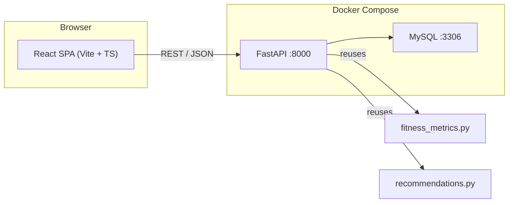

# React + FastAPI frontend for Health Tracker

## Architecture




Three containers in Compose: **React dev/nginx** (:5173 dev / :80 prod), **FastAPI** (:8000), **MySQL** (:3306 internal, :3307 host). Kafka services unchanged.

---

## Backend: FastAPI API (`backend/`)

Extract all DB + metric logic from [healthTrackerAppStreamlit.py](healthTrackerAppStreamlit.py) into a FastAPI app. Keep [fitness_metrics.py](fitness_metrics.py) and [recommendations.py](recommendations.py) as-is (import them).

### Key files

- `**backend/main.py`** -- FastAPI app, CORS, lifespan (runs `setup_database` on startup)
- `**backend/db.py`** -- connection pool (reuse `DB_CONFIG` pattern, read from env vars instead of `st.secrets`)
- `**backend/routers/auth.py**` -- `POST /api/auth/login`, `POST /api/auth/register`, returns JWT
- `**backend/routers/exercises.py**` -- `GET /api/exercises` (active), `GET /api/exercises/all` (admin), `POST/PUT/DELETE` (admin)
- `**backend/routers/workouts.py**` -- `POST /api/workouts` (save session + sets), `GET /api/workouts/sessions`
- `**backend/routers/food.py**` -- `GET /api/food/items`, `POST /api/food/intake`, `DELETE`, water intake
- `**backend/routers/goals.py**` -- `GET/PUT /api/goals`
- `**backend/routers/metrics.py**` -- `GET /api/metrics/workout-dashboard`, `GET /api/metrics/nutrition-dashboard`, `GET /api/metrics/progress-dashboard` (each returns pre-computed JSON)
- `**backend/routers/body.py**` -- `POST /api/body/metrics`, `POST /api/body/photos` (multipart), `GET /api/body/photos`, `GET /api/body/metrics`
- `**backend/auth_utils.py**` -- JWT encode/decode with `python-jose`, dependency `get_current_user`
- `**backend/Dockerfile**` -- `python:3.11-slim`, `pip install`, `uvicorn backend.main:app`

### API endpoint summary (~25 endpoints)


| Group     | Endpoints                                                                                                  |
| --------- | ---------------------------------------------------------------------------------------------------------- |
| Auth      | `POST login`, `POST register`, `GET /me`                                                                   |
| Exercises | `GET` (active, filterable by muscle_group), `GET /all` (admin), `POST`, `PUT /:id`, `DELETE /:id`          |
| Workouts  | `POST` (session + sets), `GET /sessions`                                                                   |
| Food      | `GET /items`, `POST /intake`, `DELETE /intake/:id`, `POST /water`, `DELETE /water/:id`                     |
| Goals     | `GET`, `PUT`                                                                                               |
| Metrics   | `GET /workout-dashboard`, `GET /nutrition-dashboard`, `GET /progress-dashboard` (includes recommendations) |
| Body      | `POST /metrics`, `GET /metrics`, `POST /photos`, `GET /photos`                                             |


Auth via **JWT Bearer token** (simple `HS256`, secret from `.env`). Admin endpoints check `role == "admin"` from the token.

---

## Frontend: React SPA (`frontend/`)

### Tooling

- **Vite** + **TypeScript** + **React 19**
- **React Router v7** -- client-side routing with animated page transitions
- **Framer Motion** -- page transitions, card entrance animations, micro-interactions
- **Recharts** -- lightweight charting (bar, line, area) with built-in animation
- **Tailwind CSS 4** -- utility-first styling, dark mode ready
- **Axios** -- HTTP client with interceptor for JWT
- **React Hook Form + Zod** -- form validation (workout log, food log, goals)

### Page structure and routes


| Route              | Page                                              | Key animations                                  |
| ------------------ | ------------------------------------------------- | ----------------------------------------------- |
| `/login`           | Login / Register                                  | Fade-in form, shake on error                    |
| `/`                | Dashboard overview (redirects to `/workout`)      | ---                                             |
| `/workout`         | Workout Dashboard (charts)                        | Staggered card entrance, chart draw-in          |
| `/workout/log`     | Log Workout (exercise picker, dynamic set rows)   | Slide-in set rows, spring add/remove            |
| `/nutrition`       | Nutrition Dashboard (today vs target, charts)     | Counter animation on metrics, chart morph       |
| `/nutrition/log`   | Log Food / Water                                  | Smooth accordion for meal types                 |
| `/progress`        | Progress Dashboard (scores, PRs, recommendations) | Circular score gauge animation, tip cards slide |
| `/body`            | Body Progress (weight chart, photo gallery)       | Lightbox zoom on photos, line chart draw        |
| `/settings`        | Goals and Targets                                 | Form with save confirmation animation           |
| `/admin/exercises` | Exercise catalog CRUD (admin only)                | Table row enter/exit, toast on save             |


### Layout

- **Persistent sidebar** (collapsible on mobile) with nav links + user avatar + logout
- **Top bar** with page title and breadcrumb
- **Content area** with `AnimatePresence` wrapping route transitions (slide + fade, ~300ms)
- **Toast notifications** for success/error (e.g. `react-hot-toast`)

### Key UI components

- `DashboardCard` -- animated container for each metric/chart widget
- `ExercisePicker` -- searchable dropdown filtered by muscle group
- `SetRow` -- animated add/remove rows for weight + reps + RPE/RIR
- `ScoreGauge` -- circular animated progress for training/nutrition/consistency scores
- `MacroRing` -- donut chart for today's calories/protein vs target
- `RecommendationCard` -- slide-in tip cards with category icon
- `PhotoGallery` -- grid with lightbox zoom on click

### Frontend file tree

```
frontend/
  index.html
  vite.config.ts
  tailwind.config.ts
  tsconfig.json
  package.json
  src/
    main.tsx
    App.tsx                   -- Router + AnimatePresence + Layout
    api/
      client.ts              -- Axios instance + JWT interceptor
      auth.ts, workouts.ts, food.ts, metrics.ts, body.ts, exercises.ts, goals.ts
    hooks/
      useAuth.ts             -- auth context + token storage
    components/
      Layout.tsx              -- Sidebar + TopBar + Outlet
      Sidebar.tsx
      DashboardCard.tsx
      ExercisePicker.tsx
      SetRow.tsx
      ScoreGauge.tsx
      MacroRing.tsx
      RecommendationCard.tsx
      PhotoGallery.tsx
    pages/
      Login.tsx
      WorkoutDashboard.tsx
      WorkoutLog.tsx
      NutritionDashboard.tsx
      NutritionLog.tsx
      ProgressDashboard.tsx
      BodyProgress.tsx
      Settings.tsx
      AdminExercises.tsx
    Dockerfile               -- node:20 build + nginx:alpine serve
```

---

## Docker changes

Update [docker-compose.yml](docker-compose.yml):

- **Replace** the `streamlit` service with two new services:
  - `api` -- builds `backend/Dockerfile`, exposes `:8000`, `env_file: .env`, depends on `mysql`
  - `frontend` -- builds `frontend/Dockerfile`, exposes `:5173` (dev) or `:80` (prod), depends on `api`
- **Keep** existing `mysql`, `zookeeper`, `kafka`, `kafka-ui`, `schema-registry` services untouched
- Add `JWT_SECRET` to `.env` / `.env.template`

The old `streamlit` service + `Dockerfile` at root remain in the repo but are **not started by default** (can be brought back with a profile or separate compose file if needed).

---

## Migration from Streamlit

- [healthTrackerAppStreamlit.py](healthTrackerAppStreamlit.py) stays in repo (not deleted) for reference / fallback
- `setup_database()` logic moves into `backend/db.py` `lifespan` handler (runs on FastAPI startup)
- [fitness_metrics.py](fitness_metrics.py) and [recommendations.py](recommendations.py) are **imported as-is** by the backend -- zero changes needed
- Seed logic (`seed_exercises`, `update_food_items_from_excel`) moves to backend startup
- Photo uploads served via `FastAPI StaticFiles` mount at `/uploads/`

---

## Implementation order

1. **Backend scaffold** -- FastAPI app, DB pool, auth (JWT), all routers
2. **Frontend scaffold** -- Vite + React + Tailwind + Router + Layout with sidebar
3. **Auth flow** -- Login/Register pages, JWT storage, protected routes
4. **Workout pages** -- Log Workout (exercise picker + sets) + Workout Dashboard (charts)
5. **Nutrition pages** -- Log Food/Water + Nutrition Dashboard
6. **Progress + Recommendations** -- Progress Dashboard with scores + tips
7. **Body Progress** -- Weight/waist logging + photo upload/gallery
8. **Admin page** -- Exercise catalog CRUD (admin-only route guard)
9. **Settings** -- Goals form
10. **Docker** -- Dockerfiles + updated compose + `.env` changes
11. **Polish** -- Page transitions, loading skeletons, responsive mobile layout

