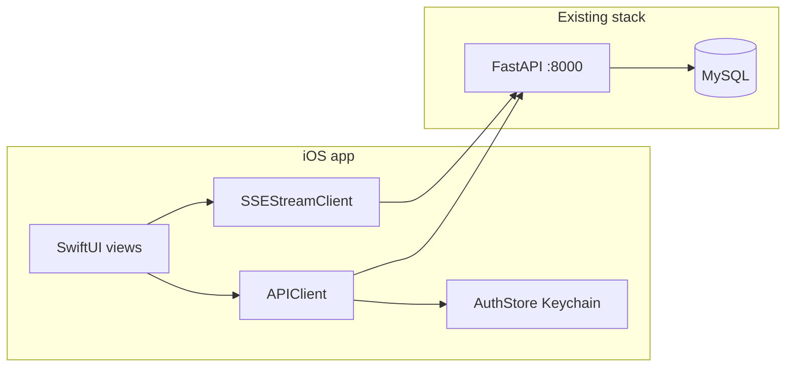

# SwiftUI iOS client (full parity)

## Architecture

- **No Python changes required** for parity if the API is reachable over **HTTPS** from the device (App Transport Security allows HTTPS by default). For LAN dev with `http://`, add a **temporary ATS exception** in the iOS target’s `Info.plist` (document only for debug builds).
- **Auth**: Same contract as the web app — `POST /api/auth/login` and `POST /api/auth/register` return `{ token, username, role }`; protected calls use `Authorization: Bearer <token>` ([backend/routers/auth.py](backend/routers/auth.py), [backend/auth_utils.py](backend/auth_utils.py)). Store the token in **Keychain** (not UserDefaults).
- **Base URL**: Single configurable root, e.g. `https://api.example.com`, with paths under `/api/...`. The web app uses a relative `/api` proxy ([frontend/vite.config.ts](frontend/vite.config.ts)); iOS must use the **full origin**.
- **Static uploads**: Body and photo APIs return paths like `/uploads/{user}/...` ([backend/routers/body.py](backend/routers/body.py)). Resolve images as `baseURLWithoutTrailingApi + path` (strip `/api` suffix from the configured API root, or use a separate `MEDIA_BASE_URL` in config if you prefer).

## Repository layout

- Create `**[ios/HealthTracker/](ios/HealthTracker/)`** (or `mobile/ios/HealthTracker/`) as an **Xcode project** committed to git: SwiftUI App lifecycle, iOS 17+ deployment (recommended for `Observable`, `Swift Charts`, modern `URLSession` async bytes).
- Add `**Config.xcconfig`** / build settings for `API_BASE_URL` (Debug vs Release) so TestFlight and local dev differ without code edits.

## Networking layer (mirror [frontend/src/api/](frontend/src/api/))

| Area      | Endpoints (prefix `/api`)                                                                                         | Notes                                                                                                                                                  |
| --------- | ----------------------------------------------------------------------------------------------------------------- | ------------------------------------------------------------------------------------------------------------------------------------------------------ |
| Auth      | `POST /auth/login`, `POST /auth/register`, `GET /auth/me`                                                         | 401 clears session and returns to login                                                                                                                |
| Exercises | `GET /exercises`, `GET /exercises/all`, `POST/PUT/DELETE /exercises/...`                                          | Admin uses `all` + mutations                                                                                                                           |
| Workouts  | `POST /workouts`, `GET /workouts/sessions`                                                                        | Match JSON shape in [frontend/src/api/workouts.ts](frontend/src/api/workouts.ts)                                                                       |
| Metrics   | `GET /metrics/workout-dashboard`, `nutrition-dashboard`, `progress-dashboard`                                     | [frontend/src/api/metrics.ts](frontend/src/api/metrics.ts)                                                                                             |
| Food      | `GET /food/items`, `POST /food/intake`, `DELETE /food/intake/{id}`, `GET` intake/water, `POST /food/water`        | [frontend/src/api/food.ts](frontend/src/api/food.ts)                                                                                                   |
| Goals     | `GET /goals`, `PUT /goals`                                                                                        | [frontend/src/api/goals.ts](frontend/src/api/goals.ts)                                                                                                 |
| Body      | `POST/GET /body/metrics`, `POST /body/photos` (multipart), `GET /body/photos`, `DELETE /body/photos/{id}`         | Use `multipart/form-data` without setting boundary manually (URLSession) — same constraint as web [frontend/src/api/body.ts](frontend/src/api/body.ts) |
| Chat      | `POST /chat/message` (SSE), `GET/DELETE /chat/history`, `POST` confirm/reject action, `GET/DELETE /chat/memories` | Parse `text/event-stream` like [frontend/src/api/chat.ts](frontend/src/api/chat.ts): events `text`, `status`, `action`, `done`                         |
| Admin     | `/admin/users`, `/admin/users/{username}/...`, `/admin/summary`                                                   | Only navigate if `role == "admin"` ([frontend/src/App.tsx](frontend/src/App.tsx) `AdminRoute`)                                                         |

Implementation sketch:

- `**APIClient`**: generic `request<T: Decodable>` / `requestData` with JSON encode-decode, query items, unified error mapping (401 → logout).
- `**SSEStreamClient**`: `URLSession.bytes(for:)` on `POST` with JSON body; incremental UTF-8 decode; split on `\n\n`; handle `event:` / `data:` lines (reuse the web client’s parsing rules).
- **Models**: `Codable` structs aligned with API responses; use `JSONDecoder` with `keyDecodingStrategy = .convertFromSnakeCase` where field names are snake_case.

## SwiftUI app structure (parity with routes)

Mirror [frontend/src/App.tsx](frontend/src/App.tsx) navigation:

- **Unauthenticated**: `LoginView` (login + register).
- **Authenticated shell**: `TabView` or sidebar-adaptive `NavigationSplitView` (iPad): Workout, Nutrition, Progress, Body, Chat, Settings; **Admin** section visible only for `admin` (exercises CRUD, users drill-down).
- **Screens**: One feature folder per domain (`WorkoutDashboard`, `WorkoutLog`, `NutritionDashboard`, `NutritionLog`, `ProgressDashboard`, `BodyProgress`, `Settings`/`Goals`, `Chat`, `AdminExercises`, `AdminUsers`). Reuse small components (cards, gauges) analogous to [frontend/src/components/](frontend/src/components/).
- **Charts**: Use **Swift Charts** for progress/workout/nutrition summaries where the web uses Recharts.
- **Chat UI**: List history from `GET /chat/history`; composer triggers SSE stream and appends assistant text incrementally; show action cards with confirm/reject calling `POST /chat/confirm-action` and `reject-action` ([frontend/src/components/chat/ActionCard.tsx](frontend/src/components/chat/ActionCard.tsx) behavior).

## Ops and distribution

- Deploy FastAPI (and MySQL) to a host with a **TLS certificate**; point `API_BASE_URL` at that origin. Align with any existing deploy path (e.g. Terraform outputs) — no code coupling required, just documentation in README for the iOS folder.
- **Privacy**: App Store privacy labels for account data, health/fitness-style metrics, and optional photo access (camera/library for body photos).
- **Future (optional)**: HealthKit import/export is not in the current API; treat as a later enhancement.

## Verification

- Run API locally or against staging; exercise login, one CRUD flow per router, chat streaming, photo upload + list, and admin-only screens with a non-admin account (expect redirect/hide).
- Test on **device** (not only simulator) for camera/photos and real network.

